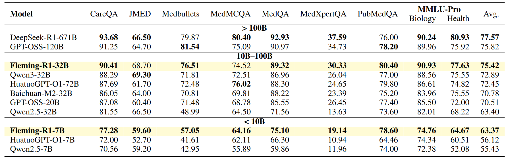
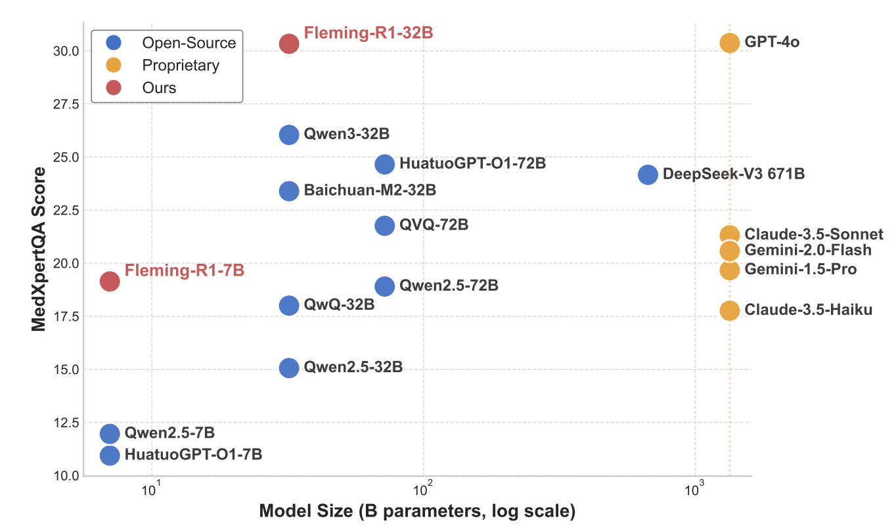

# Fleming-R1: Toward Expert-Level Medical Reasoning via Reinforcement Learning

<p align="center">
          🤗 <a href="https://huggingface.co/UbiquantAI/Fleming-R1-7B">Fleming-R1-7B</a> | 🤗 <a href="https://huggingface.co/UbiquantAI/Fleming-R1-32B">Fleming-R1-32B</a> | 📑 <a href="https://github.com/UbiquantAI/Fleming-R1/blob/main/paper/Fleming-R1.pdf">Paper</a> | <a href="https://github.com/UbiquantAI/Fleming-R1/blob/main/README_zh.md">中文</a>  | <b>English</b>
<p>

## 📖 Model Overview

Fleming-R1 is a reasoning model for medical scenarios that can perform step-by-step analysis of complex problems and produce reliable answers. The model follows a training paradigm of “chain-of-thought cold start” plus large-scale reinforcement learning. On multiple medical benchmarks, the 7B version achieves SOTA among models of a similar size; the 32B version performs close to the much larger GPT-OSS-120B and shows stronger results on Chinese tasks.

**Model Features:**

* **Reasoning-oriented data strategy** Combines public medical datasets with knowledge graphs to improve coverage of rare diseases, medications, and multi-hop reasoning chains;
* **Chain-of-thought cold start** Uses high-quality reasoning traces distilled from teacher models to guide the model in learning basic reasoning patterns;
* **Two-stage reinforcement learning** Employs adaptive hard-negative mining to strengthen the model’s reasoning when facing difficult problems.

## 📦 Releases

- **Fleming-R1-7B** —— Trained on Qwen2.5-7B  
  🤗 [`UbiquantAI/Fleming-R1-7B`](https://huggingface.co/UbiquantAI/Fleming-R1-7B)
- **Fleming-R1-32B** —— Trained on Qwen3-32B  
  🤗 [`UbiquantAI/Fleming-R1-32B`](https://huggingface.co/UbiquantAI/Fleming-R1-32B)

## 📊 Performance

### Main Benchmark Results

<div align="center">
  
</div>

### Reasoning Ability Comparison

On the MedXpertQA benchmark, which evaluates medical reasoning ability, Fleming-R1 surpasses models of similar—and even larger—sizes, and is on par with certain closed-source models.

<div align="center">
  
</div>

## 🔧 Quick Start

```python
from transformers import AutoModelForCausalLM, AutoTokenizer

model_name = "UbiquantAI/Fleming-R1-7B" # UbiquantAI/Fleming-R1-32B

# load the tokenizer and the model
tokenizer = AutoTokenizer.from_pretrained(model_name)
model = AutoModelForCausalLM.from_pretrained(
    model_name,
    torch_dtype="auto",
    device_map="auto"
)

# prepare the model input
prompt = "What should I do if I suddenly develop a fever?"
messages = [
    {"role": "user", "content": prompt}
]
text = tokenizer.apply_chat_template(
    messages,
    tokenize=False,
    add_generation_prompt=True,
)

model_inputs = tokenizer([text], return_tensors="pt").to(model.device)

# conduct text completion
generated_ids = model.generate(
    **model_inputs,
    max_new_tokens=32768
)
output_ids = generated_ids[0][len(model_inputs.input_ids[0]):].tolist() 

# parsing thinking content
output = tokenizer.decode(output_ids, skip_special_tokens=True).strip("\n")
thinking_content = output.split("<think>")[-1].split("</think>")[0]
content = output.split("</think>")[-1]

print("####thinking content:\n", thinking_content)
print("\n")
print("####answer:\n", content)
```

## ⚠️ Safety Statement

This project is for research and non-clinical reference only; it must not be used for actual diagnosis or treatment decisions.  
The generated reasoning traces are an auditable intermediate process and do not constitute medical advice.  
In medical scenarios, results must be reviewed and approved by qualified professionals, and all applicable laws, regulations, and privacy compliance requirements in your region must be followed.

## 📚 Citation

```bibtex
@misc{fleming-r1,
  title = {Fleming-R1: Toward Expert-Level Medical Reasoning via Reinforcement Learning},
  author = {Chi Liu and Derek Li and Yan Shu and Robin Chen and Derek Duan and Teng Fang and Bryan Dai},
  year = {2025},
  url = {https://github.com/UbiquantAI/Fleming-R1/blob/main/paper/Fleming-R1.pdf},
}
```
