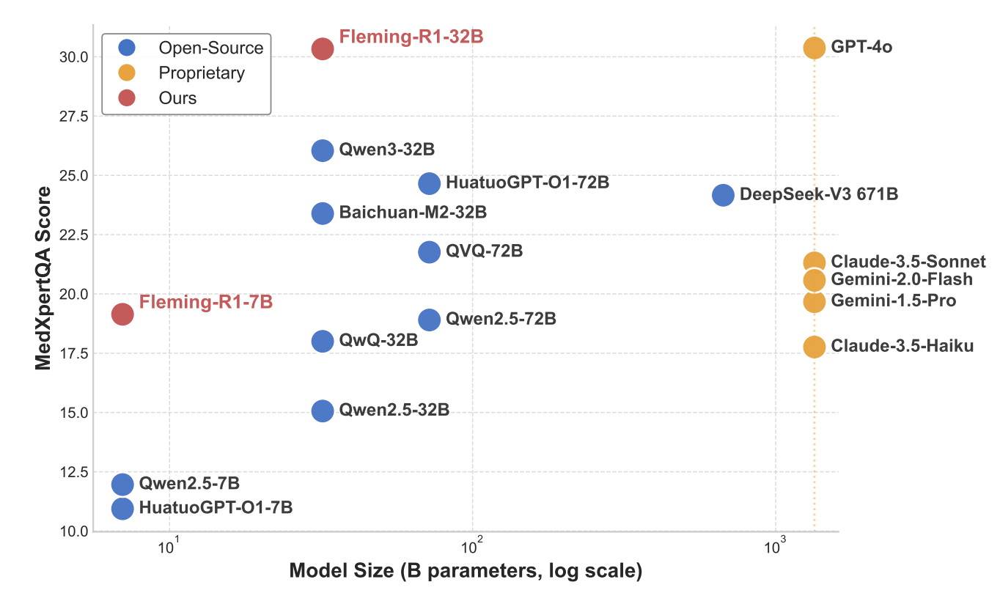

# Fleming-R1: Toward Expert-Level Medical Reasoning via Reinforcement Learning

<p align="center">
          🤗 <a href="https://huggingface.co/UbiquantAI/Fleming-R1-7B">Fleming-R1-7B</a> | 🤗 <a href="https://huggingface.co/UbiquantAI/Fleming-R1-32B">Fleming-R1-32B</a> | 📑 <a href="https://github.com/UbiquantAI/Fleming-R1/blob/main/paper/Fleming-R1.pdf">Paper</a> | <b>中文</b> | <a href="https://github.com/UbiquantAI/Fleming-R1/blob/main/README.md">English</a>
<p>

## 📖 模型简介

Fleming-R1 是一款面向医学场景的推理模型，能够对复杂问题进行逐步分析并给出可靠答案。模型采用“思维链冷启动”与大规模强化学习的训练范式。在多项医学评测中，7B 版本在同量级中达到 SOTA；32B 版本的表现接近更大规模的 GPT-OSS-120B，并在中文任务上更具优势。

**模型特点：**

* **面向推理的数据策略** 结合公开医学数据集与知识图谱，提高了对罕见疾病、药物和多跳推理链的覆盖；
* **思维链冷启动** 使用从教师模型中提炼的高质量推理轨迹，引导模型掌握基本的推理模式；
* **两阶段强化学习** 通过自适应负样本挖掘，提高模型面对困难问题时的推理能力。

## 📦 发布版本

- **Fleming-R1-7B** —— 基于 Qwen2.5-7B 训练
  🤗 [`UbiquantAI/Fleming-R1-7B`](https://huggingface.co/UbiquantAI/Fleming-R1-7B)
- **Fleming-R1-32B** —— 基于 Qwen3-32B 训练
  🤗 [`UbiquantAI/Fleming-R1-32B`](https://huggingface.co/UbiquantAI/Fleming-R1-32B)

## 📊 性能表现

### 主要基准测试结果

<div align="center">
  
</div>

### 推理能力对比

在衡量医学推理能力的MedXpertQA评测中，Fleming-R1超过了同量级甚至更大量级的模型，和一些闭源模型效果齐平。

<div align="center">
  
</div>

## 🔧 快速开始

```python
from transformers import AutoModelForCausalLM, AutoTokenizer

model_name = "UbiquantAI/Fleming-R1-7B" # UbiquantAI/Fleming-R1-32B

# load the tokenizer and the model
tokenizer = AutoTokenizer.from_pretrained(model_name)
model = AutoModelForCausalLM.from_pretrained(
    model_name,
    torch_dtype="auto",
    device_map="auto"
)

# prepare the model input
prompt = "What should I do if I suddenly develop a fever?"
messages = [
    {"role": "user", "content": prompt}
]
text = tokenizer.apply_chat_template(
    messages,
    tokenize=False,
    add_generation_prompt=True,
)

model_inputs = tokenizer([text], return_tensors="pt").to(model.device)

# conduct text completion
generated_ids = model.generate(
    **model_inputs,
    max_new_tokens=32768
)
output_ids = generated_ids[0][len(model_inputs.input_ids[0]):].tolist() 

# parsing thinking content
output = tokenizer.decode(output_ids, skip_special_tokens=True).strip("\n")
thinking_content = output.split("<think>")[-1].split("</think>")[0]
content = output.split("</think>")[-1]

print("####thinking content:\n", thinking_content)
print("\n")
print("####answer:\n", content)

```

## ⚠️安全声明

本项目仅供研究与非临床参考；不得用于实际诊断或治疗决策。
输出的推理轨迹仅为模型生成的可审计中间过程，不等于医学意见。
在医疗场景中务必由专业人员进行复核与把关，并遵守所在地区的法律法规与隐私合规要求。

## 📚 引用

```bibtex
@misc{fleming-r1,
  title = {Fleming-R1: Toward Expert-Level Medical Reasoning via Reinforcement Learning},
  author = {Chi Liu and Derek Li and Yan Shu and Robin Chen and Derek Duan and Teng Fang and Bryan Dai},
  year = {2025},
  url = {https://github.com/UbiquantAI/Fleming-R1/blob/main/paper/Fleming-R1.pdf},
}
```
